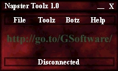



## Napster Bas \(Updated with Sample Project\)

### Description

This bas let you interact with the Napster program though api calls, letting you create programs such as bots or many other things. There are a couple of these around but this bas has a lot more subs and functions making it much easier to program. Over 36 subs and functions included. I have updated it with new functions and a sample project of what can be done with the bas.
 
### More Info
 

             |
---                |---
**Submitted On**   |2001-01-11 22:50:00
**By**             |[Skew](https://github.com/Planet-Source-Code/PSCIndex/blob/master/ByAuthor/skew.md)
**Level**          |Intermediate
**User Rating**    |4.7 (14 globes from 3 users)
**Compatibility**  |VB 5\.0, VB 6\.0
**Category**       |[Internet/ HTML](https://github.com/Planet-Source-Code/PSCIndex/blob/master/ByCategory/internet-html__1-34.md)
**World**          |[Visual Basic](https://github.com/Planet-Source-Code/PSCIndex/blob/master/ByWorld/visual-basic.md)
**Archive File**   |[CODE\_UPLOAD136931112001\.zip](https://github.com/Planet-Source-Code/skew-napster-bas-updated-with-sample-project__1-14284/archive/master.zip)

### API Declarations

A bunch.

